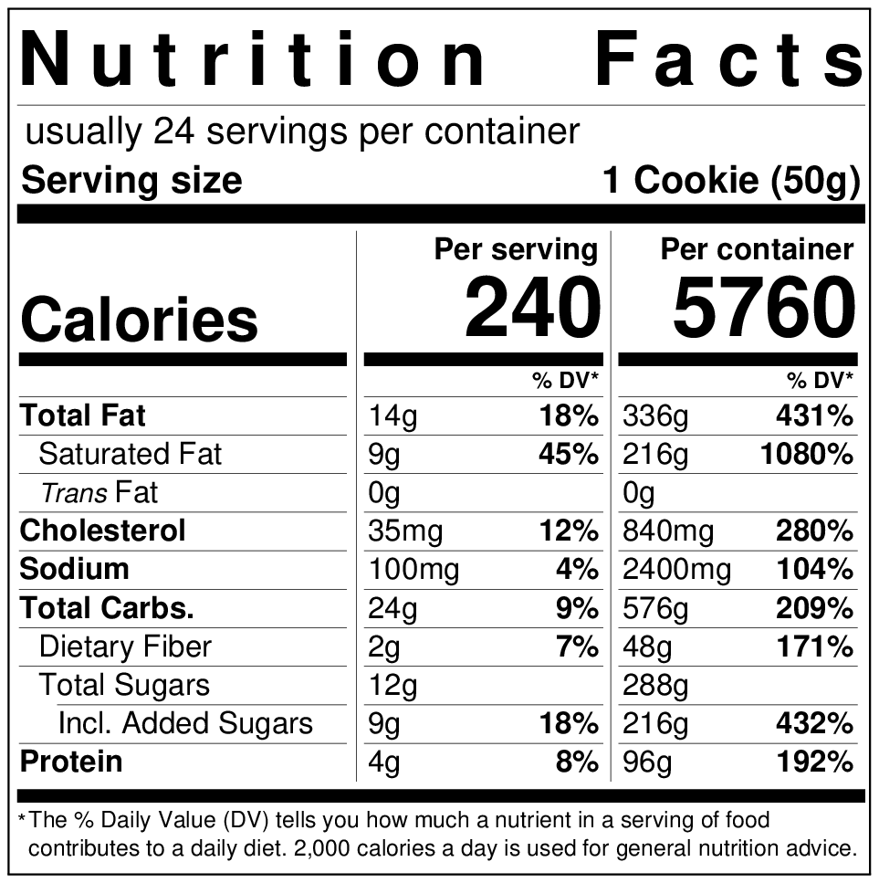

=== "Ingredients"
    * Dry Mix
        * 250 g All-Purpose Flour
        * 125 g Bread Flour
        * 6 ml Baking Powder
        * 6 ml Baking Soda
    * Spices
        * 8 ml Dry Ginger, ground
        * 4 ml Cinnamon, ground
        * 2 ml Cardamom Seeds, ground
        * 2 ml Cloves, ground
        * 2 ml Allspice Peppercorns, ground
        * 2 ml Black Peppercorns, ground
        * 2 ml Kosher Salt
    * Wet Mix
        * 220 g Unsalted Butter, melted, cooled slightly
        * 150 g Brown Sugar
        * 50 g White Sugar
        * 2 Eggs
        * 10 ml Vanilla Paste
        * 350 g Dark Chocolate, chopped

=== "Directions"
    1. **Preheat oven** to 350ºF (177ºC).
    2. **Mix dry mix.** Whisk dry mix and spices until combined.
    3. **Mix wet mix.** Cream butter and sugars until homogenous, fluffy, and voluminous. Add vanilla. One at a time, mix in eggs. Whip until just combined.
    4. **Combine.** Add dry mix to wet mix. Gently stir until just incorporated. Gently stir in chocolate.
    5. **Chill** 30 minutes, covered, if necessary.
    6. **Bake** 12-14 minutes until matte and risen slightly. Remove from heat.
    7. **Cool** 60 minutes until solid.

    !!! tip "Chill dough 30 minutes before baking if the kitchen is hot and the dough is loose and greasy."

??? info "Yields 24 cookies."
    {: width=400px loading=lazy}

[^1]:
    Adarme, Adrianna. ["Chai Masala Chocolate Chip Cookies."](https://www.acozykitchen.com/chai-chocolate-chip-cookies#wprm-recipe-container-38047) *A Cozy Kitchen.* 19 October 2017. Accessed December 2020.
[^2]:
    Mostrom, Lindsay. ["The Best Soft Chocolate Chip Cookies."](https://pinchofyum.com/the-best-soft-chocolate-chip-cookies) *Pinch of Yum.* 11 May 2015. Accessed 2019.
