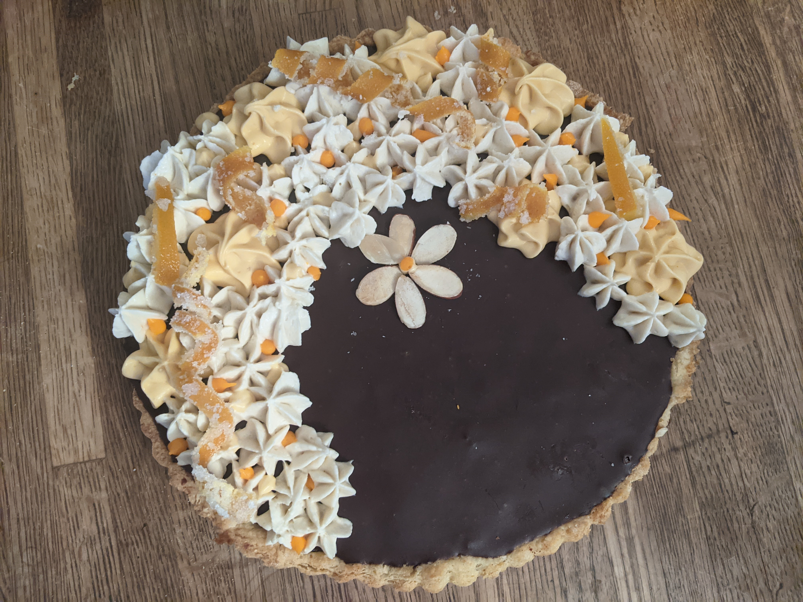
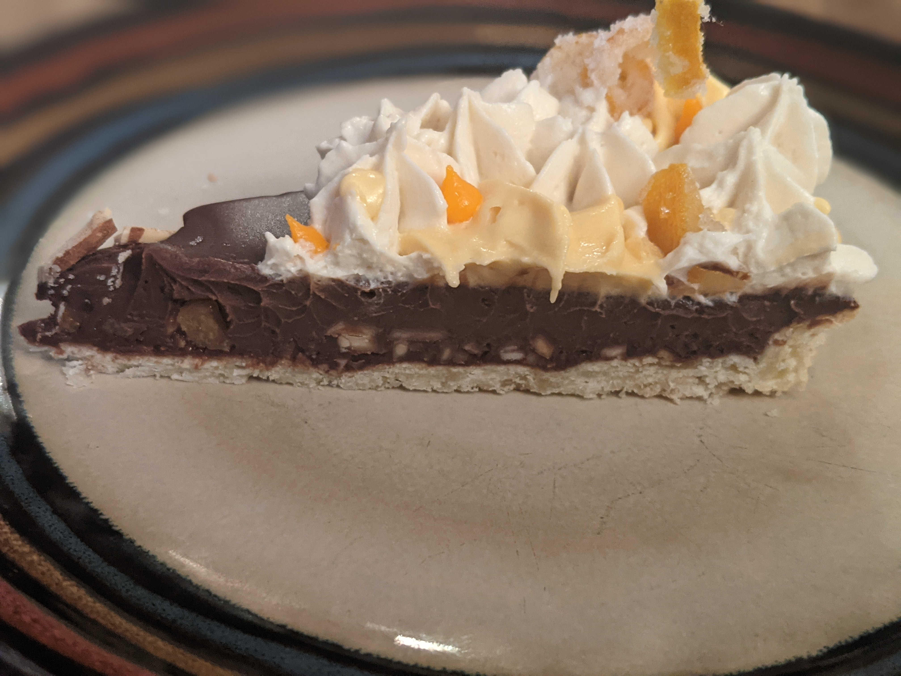

=== "Ingredients"
    * 1 [Tart Crust, blind-baked](../../breads/tart-crust.md)
    * 1 [Orange Peel, candied](../candied-orange-peel.md), chopped
    * Almond Mixture
        * 70 g Almonds, sliced, toasted, roughly chopped
        * 10 ml White Sugar
        * 5 ml Cinnamon, ground
    * Filling
        * 240 ml Heavy Whipping Cream
        * 240 g Dark Chocolate, 80%
        * 15 ml Orange Liqueur
    * Garnish
        * [Orange Peel, candied](../candied-orange-peel.md)
        * [Russian Buttercream](../russian-buttercream.md)

    !!! question "Substitute 4 ml orange extract for 15 ml orange liqueur."

=== "Directions"
    1. **Layer almond mixture.** Mix almonds, sugar, cinnamon in small bowl. Sprinkle orange peel over bottom of shortbread crust. Repeat with almond mixture.
    2. **Mix filling.** Bring cream to a simmer in saucepan and remove from heat. Whisk in chocolate until chocolate melts and mixture is smooth. Stir in orange liqueur. Pour into crust.
    3. **Chill** 3 hours until filling is firm. Garnish with remaining orange peel.
    4. **Garnish and serve.** Remove tart from pan. Garnish with orange peel and piped buttercream. Cut tart into wedges; serve cold.

=== "Photos"
    {: loading=lazy width="800px"}
    {: loading=lazy width="800px"}

[^1]:
    Fenzl, Barbara Pool. ["Dark Chocolate and Orange Tart with Toasted Almonds."](https://www.bonappetit.com/recipe/dark-chocolate-and-orange-tart-with-toasted-almonds) *Bon Appetit.* 7 April 2008. Accessed December 2020.
