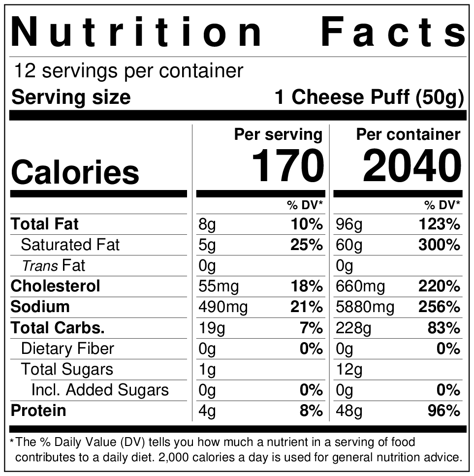

=== "Ingredients"
    * Batter
        * 180 ml Milk
        * 60 ml Unsalted Butter
        * 10 ml Kosher Salt
        * 250 g Tapioca Flour, sifted
    * Mix-ins
        * 2 Eggs, room temperature, whisked
        * 120 g Cheddar Cheese, grated
        * 60 g Pickled Jalapeños, drained, quartered
    * For Serving
        * Ranch Dressing

=== "Directions"
    1. **Preheat oven** to 400 F (205 C).
    2. **Simmer** milk, butter, salt until butter melts and mixture is about 160 F (70 C).
    3. **Stir batter.** Transfer heated liquid to a mixing bowl. Slowly mix in flour until incorporated. Cool 5 minutes.
    4. **Add mix-ins.** Mix in eggs, cheese, jalapeños until runny and lumpy.
    5. **Bake.** Transfer batter to a greased, muffin-pan. Bake at 400 F (205 C) for 5 minutes. Reduce heat to 350 F (175 C). Bake 25 minutes.
    6. **Cool** 10 minutes.
    7. **Serve** with ranch dressing.

    !!! tip "Be careful not to overmix the eggs and cheese into the batter!"

??? note "Yields 12 jalapeño poppers."
    {: width=400px loading=lazy}

[^1]:
    Lupescu, Valya Dudycz, Stephen H. Segal, and Dingding Hu. [*Forking Good: An Unofficial Cookbook for Fans of The Good Place.*](https://www.amazon.com/dp/1683691555) Philadelphia, PA: Quirk Books, 2019.
